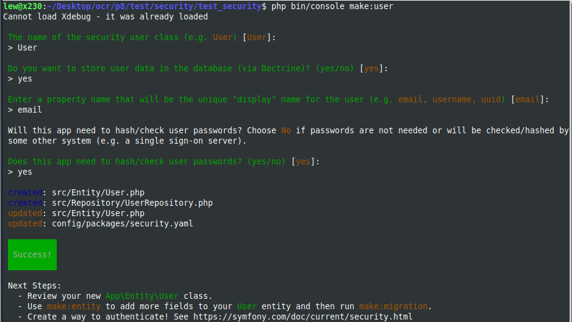

ToDo & Co
Documentation technique

Auteur : Jonatan Buzek
Date : 04/2023

# Authentification d’un utilisateur dans Symfony

## 1. Bundle SecurityBundle
Symfony est un framework PHP fournissant de nombreux outils permettant de sécuriser une application. Le bundle SecurityBundle fournit les fonctionnalités d’authentification et d’autorisation.

S’il n’est pas déjà installé dans un projet, vous pouvez l’installer via la commande : 
`composer require symfony/security-bundle`

Ce bundle fournit le fichier de configuration `config/packages/security.yaml` qui permet de gérer les paramètres de gestion de la sécurité des utilisateurs.
```
security:
    # https://symfony.com/doc/current/security.html#registering-the-user-hashing-passwords
    password_hashers:
        Symfony\Component\Security\Core\User\PasswordAuthenticatedUserInterface: 'auto'
    # https://symfony.com/doc/current/security.html#loading-the-user-the-user-provider
    providers:
        # used to reload user from session & other features (e.g. switch_user)
        app_user_provider:
            entity:
                class: App\Entity\User
                property: email
    firewalls:
        dev:
            pattern: ^/(_(profiler|wdt)|css|images|js)/
            security: false
        main:
            lazy: true
            provider: app_user_provider
            form_login:
                # "app_login" is the name of the route created previously
                login_path: app_login
                check_path: app_login
                enable_csrf: true
            logout:
                path: app_logout

            # activate different ways to authenticate
            # https://symfony.com/doc/current/security.html#the-firewall

            # https://symfony.com/doc/current/security/impersonating_user.html
            # switch_user: true

    # Easy way to control access for large sections of your site
    # Note: Only the *first* access control that matches will be used
    access_control:
        # - { path: ^/admin, roles: ROLE_ADMIN }
        # - { path: ^/profile, roles: ROLE_USER }

when@test:
    security:
        password_hashers:
            # By default, password hashers are resource intensive and take time. This is
            # important to generate secure password hashes. In tests however, secure hashes
            # are not important, waste resources and increase test times. The following
            # reduces the work factor to the lowest possible values.
            Symfony\Component\Security\Core\User\PasswordAuthenticatedUserInterface:
                algorithm: auto
                cost: 4 # Lowest possible value for bcrypt
                time_cost: 3 # Lowest possible value for argon
                memory_cost: 10 # Lowest possible value for argon

```


## 2. L'entité utilisateur
Afin de mettre en place l'authentification des utilisateurs, ceux-ci doivent être liés à un objet user. Pour créer la classe **User** sous **Symfony**, nous pouvons utiliser le bundle **MakerBundle** et lancer la commande :
`php bin/console make:user` 




La classe **User** de l'application implémentant les interfaces **UserInterface** et **PasswordAuthenticatedUserInterface** :

```
<?php

namespace App\Entity;

use App\Repository\UserRepository;
use Doctrine\Common\Collections\ArrayCollection;
use Doctrine\Common\Collections\Collection;
use Doctrine\ORM\Mapping as ORM;
use Symfony\Bridge\Doctrine\Validator\Constraints\UniqueEntity;
use Symfony\Component\Security\Core\User\PasswordAuthenticatedUserInterface;
use Symfony\Component\Security\Core\User\UserInterface;

#[ORM\Entity(repositoryClass: UserRepository::class)]
#[UniqueEntity(fields: ['email'], message: 'There is already an account with this email')]
class User implements UserInterface, PasswordAuthenticatedUserInterface
{
   ...
}

```

Lors de la création de la classe, il a été défini que les données liées aux utilisateurs seront stockées dans la base de données via **Doctrine** dans la table `user`.

En plus de créer l'entité, la commande `make:user` ajoute une configuration pour la partie  `providers` du fichier `security.yaml`
```
    providers:
        # used to reload user from session & other features (e.g. switch_user)
        app_user_provider:
            entity:
                class: App\Entity\User
                property: email
```

Le provider va charger l'entité **User** via la propriété **email**.

L'implémentation de l'interface **PasswordAuthenticatedUserInterface** apporte les fonctionnalités de hachage de mot de passe et de vérification de mot de passe.
```
// src/Entity/User.php

// ...
use Symfony\Component\Security\Core\User\PasswordAuthenticatedUserInterface;

class User implements UserInterface, PasswordAuthenticatedUserInterface
{
    // ...

    /**
     * @return string the hashed password for this user
     */
    public function getPassword(): string
    {
        return $this->password;
    }
}
```

`security.yaml`
```
security:
    # https://symfony.com/doc/current/security.html#registering-the-user-hashing-passwords
    password_hashers:
        Symfony\Component\Security\Core\User\PasswordAuthenticatedUserInterface: 'auto'
```

## 3. L'authentification d'un utilisateur
Lorsque un utilisateur non identifié accède à l'application, il est automatiquement redirigé vers le formulaire de login `templates/user/login.html.twig` via la route `app_login`.

Le contrôleur du login des utilisateurs :
```
<?php

namespace App\Controller;

use Symfony\Bundle\FrameworkBundle\Controller\AbstractController;
use Symfony\Component\HttpFoundation\Response;
use Symfony\Component\Routing\Annotation\Route;
use Symfony\Component\Security\Http\Authentication\AuthenticationUtils;

class SecurityController extends AbstractController
{
    #[Route('/login', name: 'app_login')]
    public function login(AuthenticationUtils $authenticationUtils): Response
    {
        $error = $authenticationUtils->getLastAuthenticationError();
        $lastUsername = $authenticationUtils->getLastUsername();
        return $this->render('user/login.html.twig', [
            'last_username' => $lastUsername,
            'error'         => $error,
        ]);
    }

    #[Route('/logout', name: 'app_logout', methods: ['GET'])]
    public function logout()
    {
        // controller can be blank: it will never be called!
    }
}
```
Le rôle du contrôler de login est seulement de générer la page de formulaire de login. La vérification du nom d'utilisateur et du mot de passe est géré par le module de sécurité de Symfony `Symfony\Component\Security\Http\Authentication\AuthenticationUtils`.

La partie **Firewall** du fichier de configuration `security.yaml`. Cette partie gère la partie authentification en définissant comment les utilisateurs vont être authentifiés (formulaire de login dans le cas de l'application ToDo liste).
```
security:

    firewalls:
        dev:
            pattern: ^/(_(profiler|wdt)|css|images|js)/
            security: false
        main:
            lazy: true
            provider: app_user_provider
            form_login:
                # "app_login" is the name of the route created previously
                login_path: app_login
                check_path: app_login
                enable_csrf: true
            logout:
                path: app_logout

            # activate different ways to authenticate
            # https://symfony.com/doc/current/security.html#the-firewall

            # https://symfony.com/doc/current/security/impersonating_user.html
            # switch_user: true
```

## 4. L'accès aux différentes sections de l'application
L'accès aux différentes sections de l'application est géré directement dans les contrôleurs via les [attributs](https://php.watch/articles/php-attributes) introduits dans PHP 8.

Les routes de l'application nécessistant une connexion préalable de l'utilisateur ont un attribut :
`#[IsGranted('IS_AUTHENTICATED')]`
Les routes de l'application nécessistant un droit admin ont un attribut :
`#[IsGranted('ROLE_ADMIN')]`

**Détail des restrictions des routes de l'application**
| Route  | Path | Détail | Rôle minimum nécessaire |
| ------------- | ------------- | ------------- | ------------- |
| app_register | /register | Formulaire de création de compte | Aucun |
| app_login | /login  | Formulaire de connexion | Aucun |
| app_logout | /logout | Déconnexion | ROLE_USER |
| home | / | Page d'accueil | ROLE_USER |
| create_task | /task/create | Formulaire de création de tâche | ROLE_USER |
| list_task | /task/list | Liste des tâches | ROLE_USER |
| update_task | /task/update/{taskId} | Mise à jour d'une tâche | ROLE_USER |
| status_task | /task/status/{taskId}/{taskStatus} | Changement du statut de la tâche (faite/à faire) | ROLE_USER |
| delete_task | /task/delete/{taskId} | Supprimer une tâche | ROLE_USER pour une tâche créée par l'utilisateur  ROLE_ADMIN pour toutes les tâches |
| update_user | /user/update | Éditer ses paramêtres d'utilisateur | ROLE_USER |
| admin_update_user | /user/admin_update/{userId} | Éditer un utilisateur (changer le rôle) | ROLE_ADMIN |
| delete_user | /user/delete/{userId} | Supprimer un utilisateur | ROLE_USER pour supprimer son propre compte  ROLE_ADMIN pour supprimer un autre compte |
| list_user | /user/list | Liste des utilisateurs | ROLE_ADMIN |
